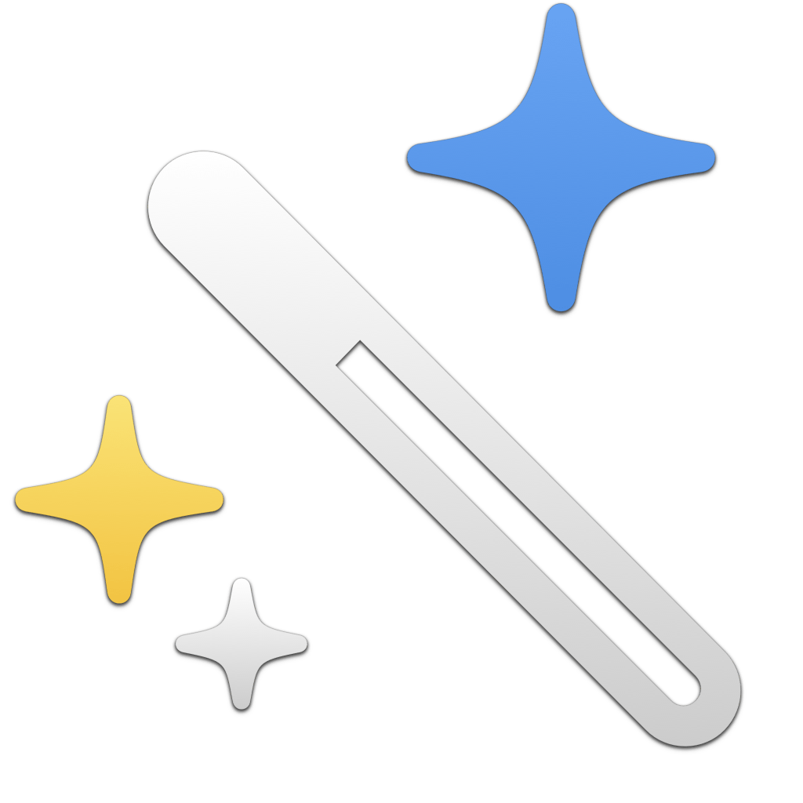

<p align="center">
    
</p>

<p align="center">
    
    
    <a href="https://danielsaidi.github.io/StandardButtons"></a>
    <a href="https://github.com/danielsaidi/StandardButtons/blob/master/LICENSE"></a>
    <a href="https://github.com/sponsors/danielsaidi"></a>
</p>


# StandardButtons

StandardButtons is a SwiftUI library that lets you create standard button types, with localized titles, icons & roles.

<p align="center">
    
</p>

StandardButtons defines **110+** standard button types, like ``.add``, ``.delete``, ``.edit``, ``.done``, etc. Each type has a localized ``.title``, ``.image``, ``.role``, and (optional) ``.keyboardShortcut``.


## Installation

StandardButtons can be installed with the Swift Package Manager:

```
https://github.com/danielsaidi/StandardButtons.git
```


## Support My Work

You can [become a sponsor][Sponsors] to help me dedicate more time on my various [open-source tools][OpenSource]. Every contribution, no matter the size, makes a real difference in keeping these tools free and actively developed.


## Getting Started

This library has ``StandardButtonType``-based ``Button``, ``Label`` & ``Link`` initializers for creating standard controls:

```swift
Button(.add) { ... }
Label(.add) { ... }
Link(.email, destination: .email(...))
```

This will render regular views that work on all major Apple platforms (iOS, macOS, tvOS, watchOS, visionOS), and that applies a proper icon, localized title, role, accessibility traits, etc for the provided button type.

You can use the ``StandardAction`` enum to generate a ``control`` for common actions, like ``.call(phoneNumber:)``, ``.copy(_:)``, ``.email(address:)``, and ``.openUrl(_:)``.

```swift
StandardAction.email(address: "daniel@gmail.com").control
```

You can also use URL extensions like ``.call(number:)`` and ``.email(address:)`` for common actions. These are used by the ``StandardAction`` when generating call and email action controls.


## Localization

This library is localized in the following languages:

* 🇩🇰 Danish 
* 🇺🇸 English (US)
* 🇫🇷 French
* 🇬🇪 Georgian
* 🇩🇪 German
* 🇳🇴 Norwegian Bokmål
* 🇪🇸 Spanish
* 🇸🇪 Swedish

You can add more locales to the `Localizable.xcstrings` file in the `Resources` folder, then localize them as described in [this blog post](https://danielsaidi.com/blog/2025/06/08/using-ai-and-cursor-to-localize-xcode-string-catalogs).


## Documentation

The online [documentation][Documentation] has more information, articles, code examples, etc.


## Demo Application

This repository will get a demo app after it reaches 100 stars.


## Contact

Feel free to reach out if you have questions, or want to contribute in any way:

* Website: [danielsaidi.com][Website]
* E-mail: [daniel.saidi@gmail.com][Email]
* Bluesky: [@danielsaidi@bsky.social][Bluesky]
* Mastodon: [@danielsaidi@mastodon.social][Mastodon]


## License

StandardButtons is available under the MIT license. See the [LICENSE][License] file for more info.


[Email]: mailto:daniel.saidi@gmail.com
[Website]: https://danielsaidi.com
[GitHub]: https://github.com/danielsaidi
[OpenSource]: https://danielsaidi.com/opensource
[Sponsors]: https://github.com/sponsors/danielsaidi

[Bluesky]: https://bsky.app/profile/danielsaidi.bsky.social
[Mastodon]: https://mastodon.social/@danielsaidi
[Twitter]: https://twitter.com/danielsaidi

[Documentation]: https://danielsaidi.github.io/StandardButtons
[License]: https://github.com/danielsaidi/StandardButtons/blob/master/LICENSE
